<iframe width="560" height="315" src="https://www.youtube.com/embed/X6YoRYNoP9E" frameborder="0" allow="accelerometer; autoplay; encrypted-media; gyroscope; picture-in-picture" allowfullscreen></iframe>

## Project summary

​		Our team topic is doing archery. More specifically, we want to teach our agent to kill the Mob using bow and arrows. Mob will be placed into a closed area  we created, and our agent will stand on a fixed block to learn its archery skill.  Each action made by agent is based on Mob’s current position and moving directions. When each round over, record will be updated so that system would always return the best result. Our final goal is to kill the Mob using the fewest arrows (3 shots). 

 

## Approach

### Algorithm

We Used one of most popular Learning Algorithm in Reinforcement learning for our case, ***Q-Learning***, which maintains a Q-table that will given a score for each state. Our agent  will choose the action based on the best score it can get from current state. After every action made by agent, the system will given a score based on  the formula above to update the Q-value for current state. 

- Q(s_t,a_t): is the old value of current state and current action
- a: alpha is the learning rate that affect current Q-value
- r_t: is the current reward that system given based on current action
-   γ: gamma is the constant value that times the best Q-value of next state as a part of reward.
- max ( Q(S_t+1,a) ): is the best Q-value of next state. 

At the beginning,  when Q - table is empty , there is no Q-score can be extracted for any states. Our group will use a factor called Epsilon as a random rate that give agent will perform a random action , then the system will give a reward (negative or positive) for the action that agent just made. Epsilon will decrease with the arrow numbers that our agent already performed. Indeed , (1- epsilon) is the possibility that the agent will choose the action based on the best Q-value of current state. For both cases, that new Q-value will be generated following the formula above.

 

### Parameter choices 

***Epsilon:*** We used a greedy Epsilon approach that decrease epsilon number by 0.1 for every 10000 actions we trained. In our case we start from ***0.6*** to ***0.3***. 

***Alpha:*** we used ***0.4*** as our learning rate, since there is little random error for arrows' parabolic trajectory in Minecraft. If error happened, the angle used to hit the target under a specific states will receive a negative reward. The alpha larger than 0.5 will affect the result we learned before so we choose 0.4 as our learning rate which is the largest learning rate we can reach.

***Gamma:*** since the state transition sometimes is not stable, we used ***0.2*** as our discount factor.

### States & Actions

* State: (z, x, z_motion, x_motion)

  There are four variables in our state definition. Variables z and x represent the position of mob at z and x direction. Variables z_motion and value x_motion represent the moving forward or backward of the mob at z and x direction. We round the z, x value to be its nearest integer value because our target only takes one block area. There are 3 values for z_motion and x_motion which represents moving forwards(1), standstill(0) and moving backwards(-1). The states numbers of our project are 441, 225, 81 which represents our 3 different environment setting(easy, medium, hard).  

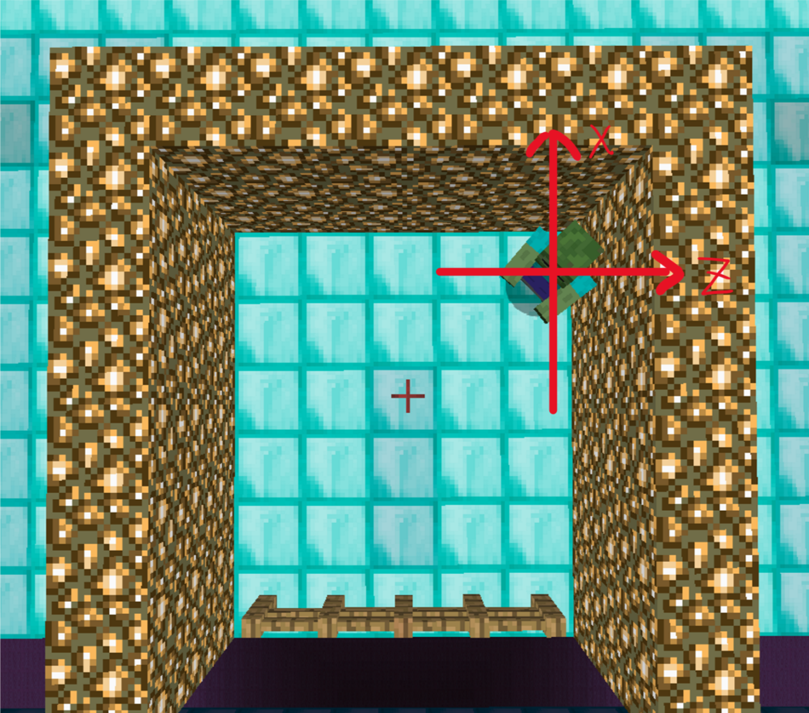

  ​					(This is the two motion direction that zombie can made)

   

  

  - Easy: is that mode that Mob will trapped into a ***3x3*** closed area. (81 States)
    
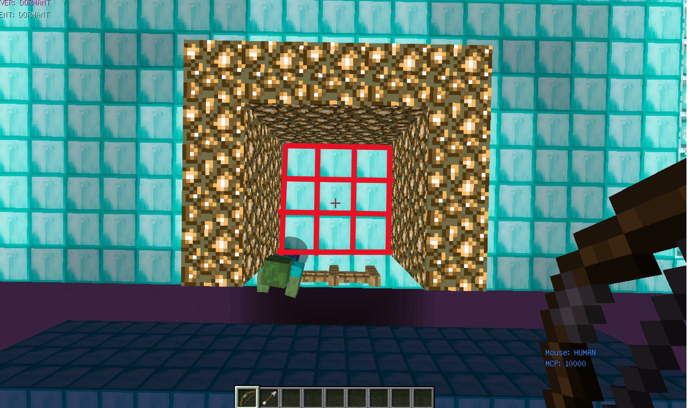

   

  

  - Medium: is that mode that Mob will trapped into a ***5x5*** closed area.(225 States) ***Current mode we trained***
  
   
  
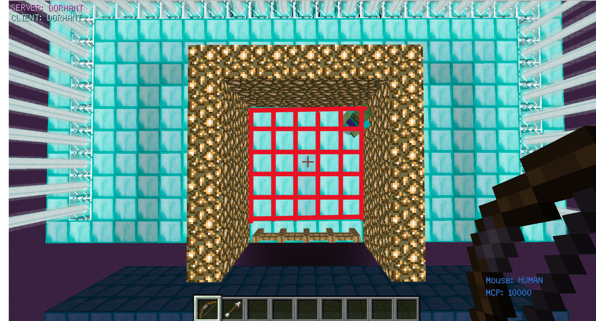

  

   

  - Hard:is that mode that Mob will trapped into a ***7x7*** closed area.(441 States)
  
   

   

* Action: (Yaw, Pitch, shoot/hold)

  Variables Yaw and Pitch represent the aiming angles in horizontal and vertical directions. Shoot/hold decides whether the agent shoot the arrow or not. For Yaw variable, we divide the continuous angle interval to the finite angle levels, which covers the horizontal activity range of the mob as shown in the graph below. Same thing applies to the Pitch variable. Since there are too many angles that agent can choose, so after several tests by hand we conclude different angles.

  ​	

  - ***Easy:*** yaw5=[86,88,90,92,94]     pitch=[0,-1,-2,-3,-4,-5]     (total choices: 5x6x2=60)

    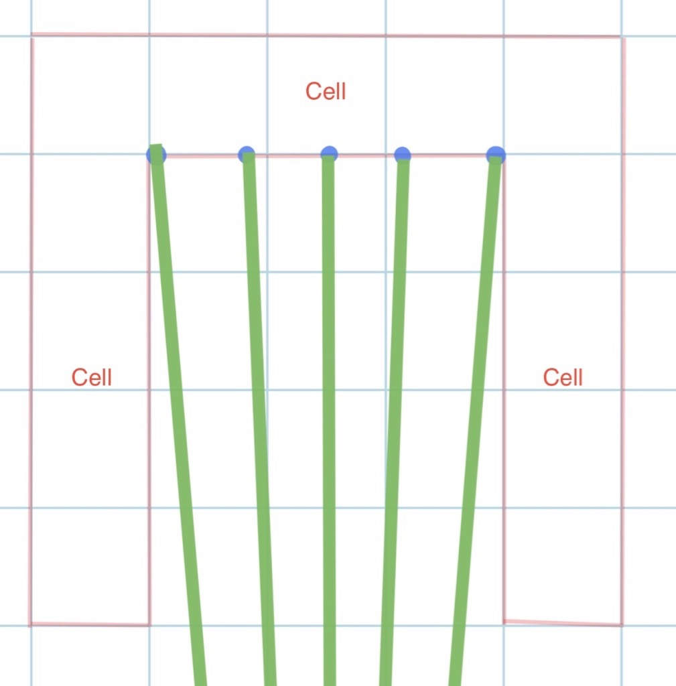

    ​								(vertical angles for easy mode)

  - ***Medium:***  yaw5=[81,83,85,87,89,91,93,95,97,99] pitch=[0,-1,-2,-3,-4,-5] (total choices: 10x6x2=120) ***Current mode we trained***

    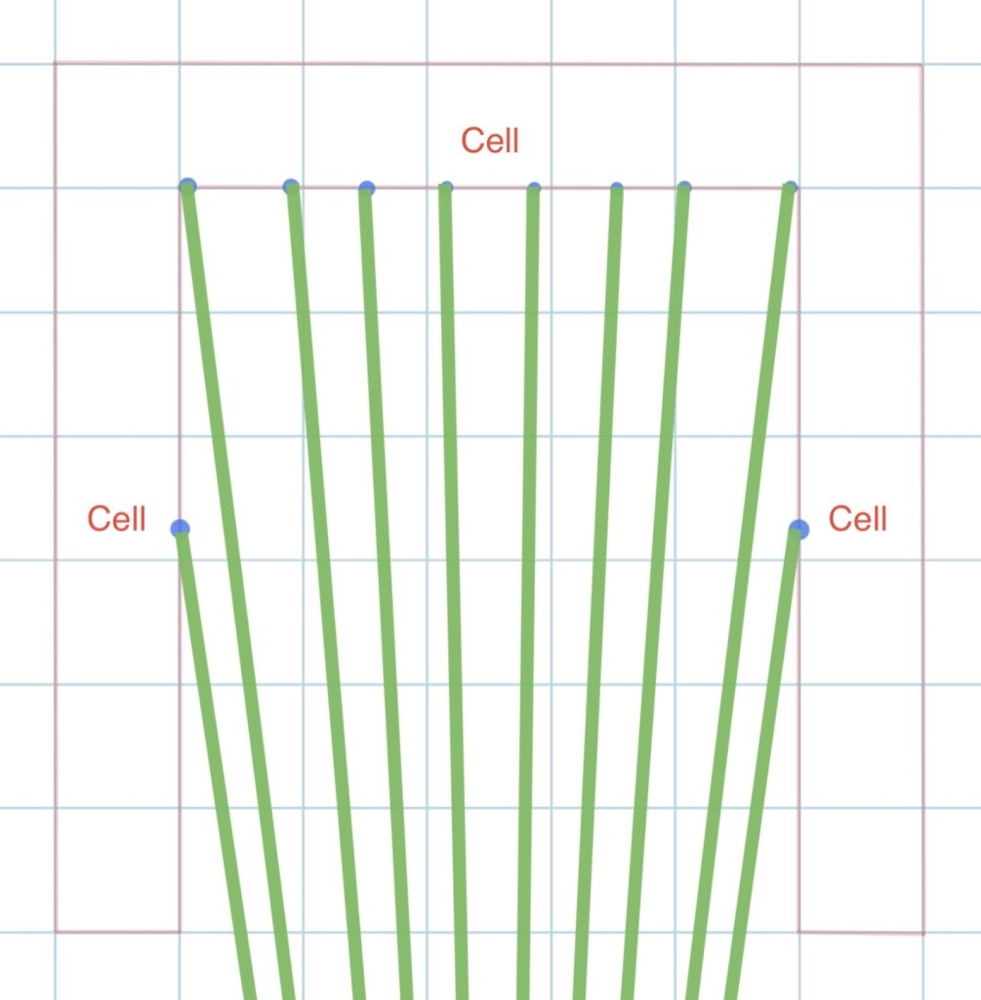

    ​						  	(vertical angles for Medium mode)

  - ***Hard:*** yaw5=[77,79,81,83,85,87,89,91,93,95,97,99,101,103] pitch=[0,-1,-2,-3,-4,-5] (total choices: 14x6x2=168)

    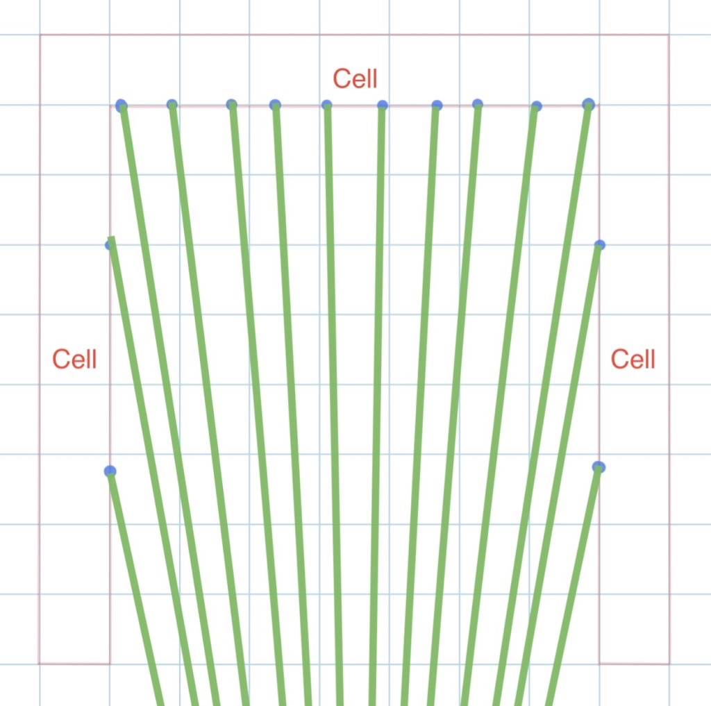

    ​							        (vertical angles for Hard mode)

  

  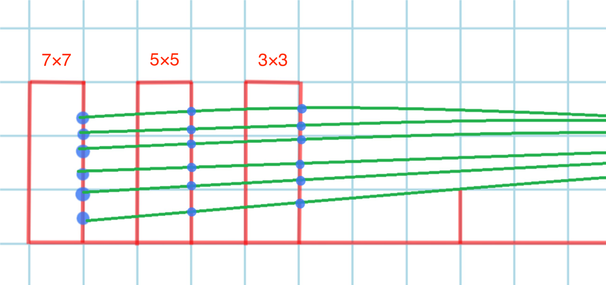

  ​			(This the vertical degrees we can choose for  three different modes)

   

* Total combinations
  - Easy: states x actions= 81 x 60 =4860
  - Medium: states x actions= 225 x 120 = 27000
  - Hard: states x actions= 441 x 168 = 74088

   

### ways of states transfer

The ways of states transfer decides the value that will be used in the formula mentioned above to update Q-table.

 

1. ***States changed by Mob itself***
   When agent choose to shoot but not hit the target, or choose to hold. The states of the Mob will not be changed  by these two actions. Under this condition, Mob just move randomly in the closed area. Indeed, the next state is based on the current motion and its position. For example, if Current state is (3,5,1,-1) then the next state will be (4,4,0,0). Followed the Q-learning formula above new Q-value will be  ***(1-alpha) x Old Q-value + alpha(current reward + gamma x best Q-value for next state we generated)***. and also if we choose to shoot but we didn't hit the target, we will not only update the value current angle with shoot action, the system will also update Q-value for the current angle with hold action as  ***(1-alpha) x Old Q-value + alpha(3 + gamma x best Q-value for next state we generated)***. we replace current reward to positive three here. Indeed, next time when agent making decision about the same angle, hold action will have higher priority than shoot action. The reason we make the Q-table update twice rather than one is that the table will be state and action Q-value will be initialized as 0, and if we only make angle not hit the target to negative, then the table will choose the first action that has 0 reward and it will waste a lot of chance to learn. Indeed we will give a higher reward for this angle with hold action, then the agent will choose to hold until to get a new random angle to learn.

    

2. ***States changed by agent***
   In this case, the states will only change based on the precondition that agent hit the target. Every time, when mob hit by an arrow, he will retreat one or less than one block to the opposite direction of the arrow goes to. This state transfer way is really hard to measure its updated state immediately. Indeed, we set 5 arrows as one round.  if the target hit by agent then the reward will follow the current reward + rest 4 arrows' reward  times gamma(discount factor) with power (the difference of index of current arrow and other arrows)  because further arrows has less effect than current arrow. Indeed we will follow the formula above as form of ***(1-alpha) x Old Q-value + alpha(current reward + gamma x reward for next arrow we generated + gamma ^2 x reward for next  next arrow we generated+ ...)*** .

   

   The image shows that Mob will move backward after hit by the arrow.

   

 

The way of states transfer decides the way of reward given to each state and action which will affect the new Q-value.

 

### Reward System

The reward given is based on the blood difference of Mob. 

If the action didn't hit the target reward will be ***-15***.

if the action hit the target reward will be ***17***.

if the action kill the target reward will be ***95***

if the action is hold, reward will be ***0***.

 

### Keep learning

Q-table is stored in a JSon file called q-table, which can be used for further learning. The folder history also contains the Q-table on different training phases.

 

## Evaluation

### accuracy

We calculated accuracy based on the arrow that hit the target and the total arrows we shoot.

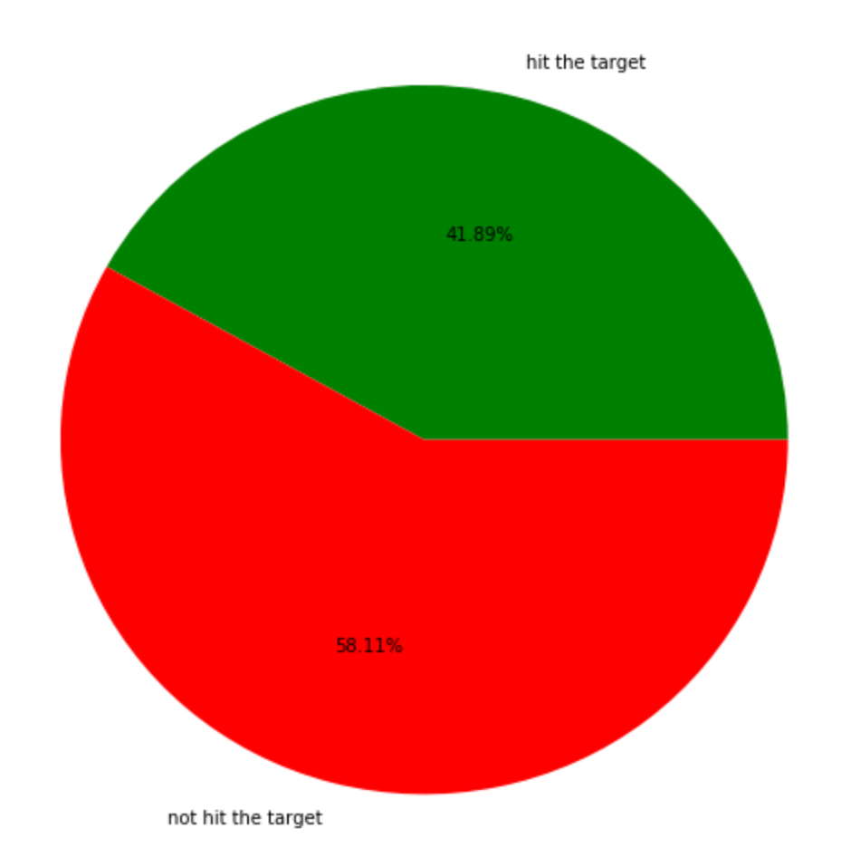

​									(Total training accuracy)

The pie chart below is the accuracy we covered for all of our training Process. This accuracy Probably looks not good enough, but the result is much better than our expectation.  Since for our training cases, we have 120 different possible actions for any states, and states transition is not stable. Therefore, it takes really long time to train our agent. The pie charts below ordered as the order of training process so its trend already tell us the accuracy is getting better and better. 

 

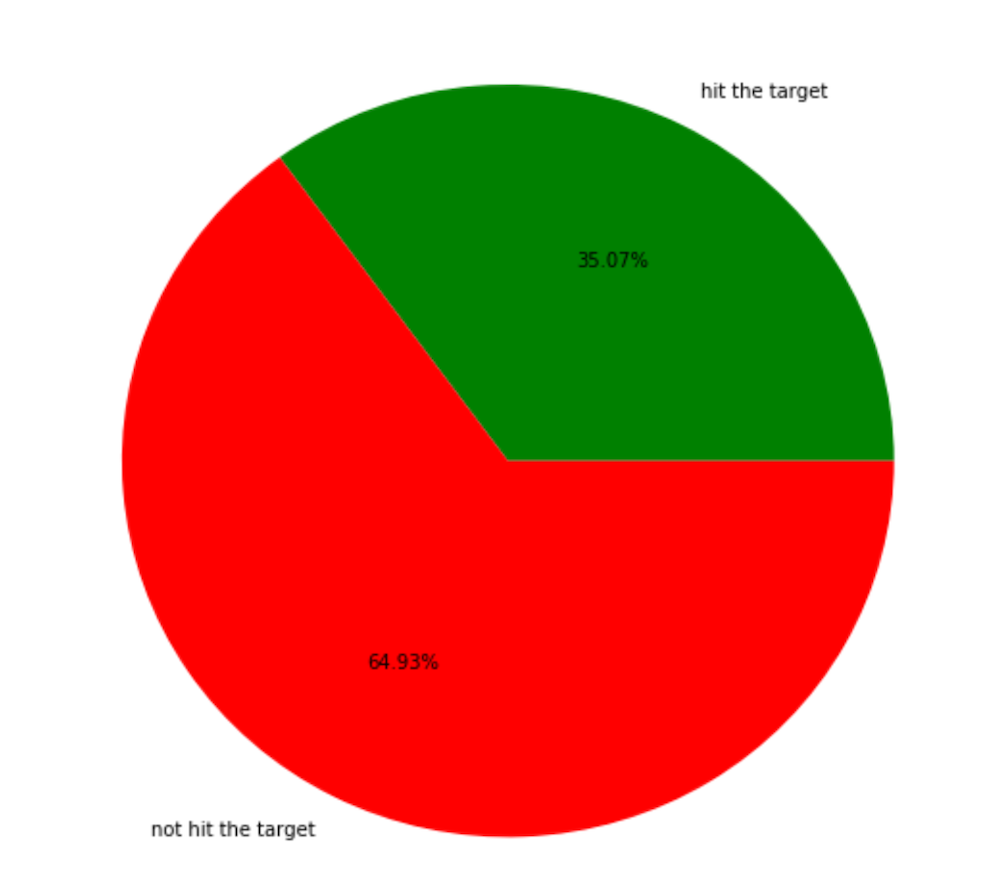

​								   (0-10000 actions made accuracy)

The graph here is the early training process, so the accuracy is not high enough, since the epsilon is very high, that actions made heavily based on the random rate.

 

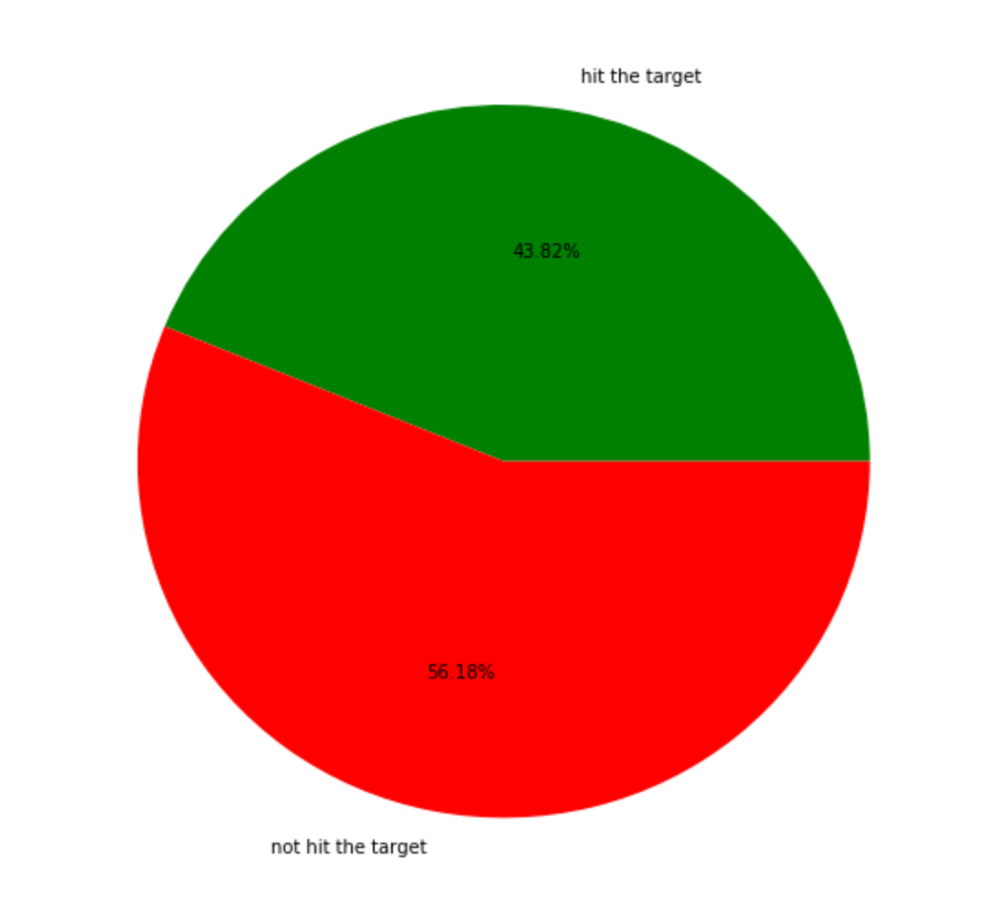

​								   (10000-20000 actions made accuracy)

The accuracy increased 8 percent from first process to second process, one reason is epsilon decrease and Q-table learned enough experience for hitting the Mob on different states.

 

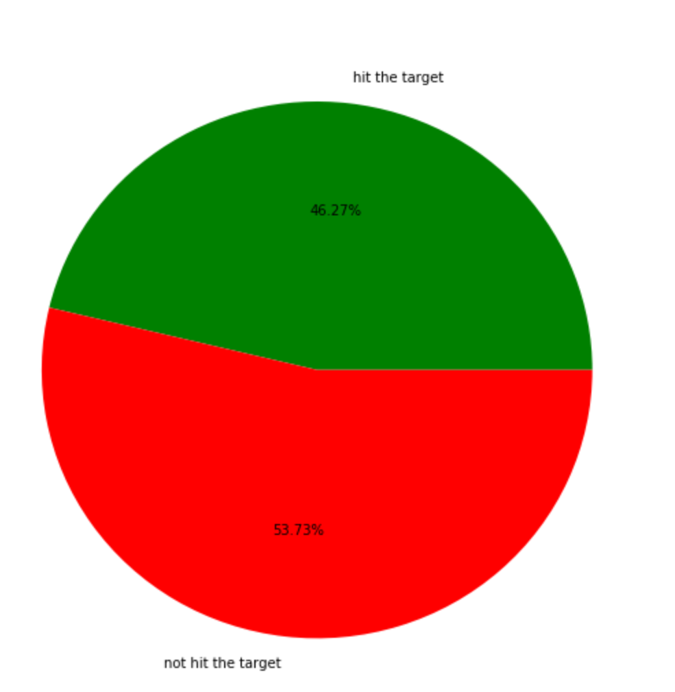

​								  (20000-30000 actions made accuracy)

The accuracy is still in growth trend, but the growth rate is getting smoother.  Q-table is empty at early time,  as time passed more and more index get filled. After a period of time there is not that much empty indexes so the growth is getting smoother.

 

### Hold VS. Shoot

The graph below the is the percentage of shoot and hold, since hold is one of most important way that improve our accuracy of shoot. If there is no angle learned to hit the target, "hold" is a better choice than "shoot" to an angle we cannot hit the target.  This is why hold covered a large portion of agent decision action.

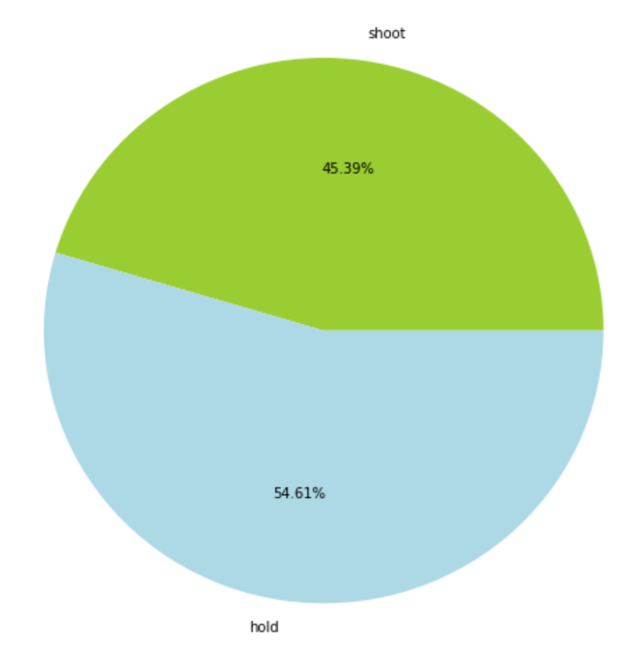

 

### reward

 

The graphs below record the reward status on different learning stages. The first graph record the first 200 arrows reward situation. The second graph record the middle stage of training and the last graph is the final stage of training. Y-axis is the reward for each arrow get, and X-axis shows the arrow numbers.

​								   	(0-200 arrows reward situation)

Mob never get killed at early time since there is no reward above close to 100. Also the negative scores is much more than 0 and 15 since the agent is still randomly learning in this stage.

 

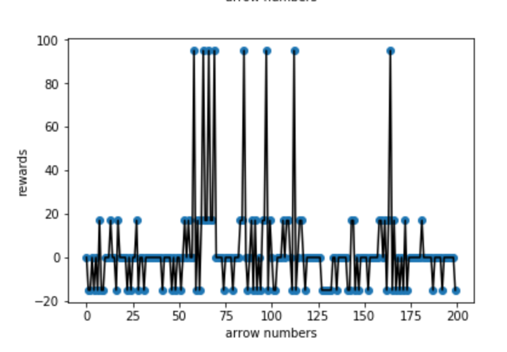

​								 	(25000-25200 arrows reward situation)

This graph is in middle stage of training. There are several 95 score reward on graph which means the agent has ability to kill the Mob now. but still more action is still concentrate on 0 which means the agent is still choose to hold at most of the time.

 

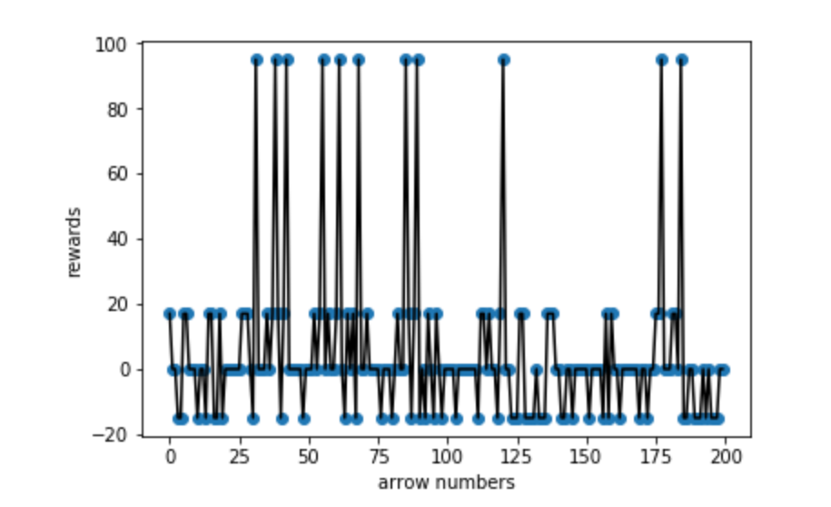

​									(35000-35200 arrows reward situation)

For the graph above, the point that didn't hit the target is getting less. In order word more kills that agent can get and shooting accuracy is getting higher. Similarly as the pie chart trend above the accuracy is getting better. Since, we need to hit target 3 times minimum in 5 arrows to kill the Mob, so the reward situation  reachs our expectation.

 

### heatmap arrows shoot on different angles

The heatmap represents the agent choices on different vertical and horizontal angles. The function of the heat map over here is to reduce the effect of random initialized position brought to final result. The horizontal axis represent horizontal angles and the vertical axis represent the vertical angles.  The first map is the map that arrow shoot on different angles. The second map shows the total number of Mob shot by agent on different angles.The last one is the map of accuracy on different angles.

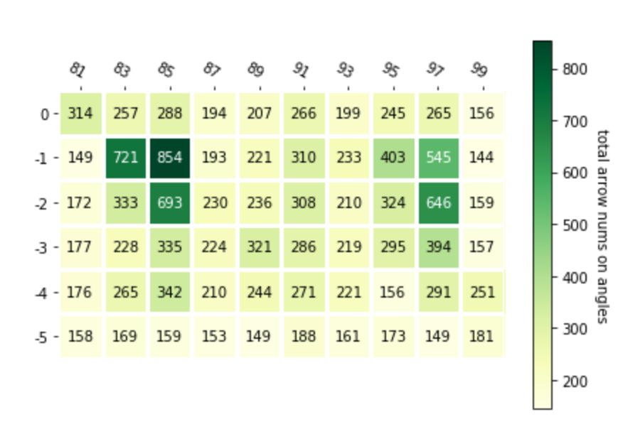

The map above shows that agent choose more angle on two sides of the horizontal axis. It means the Mob is more standing on two side of the closed area. 

 

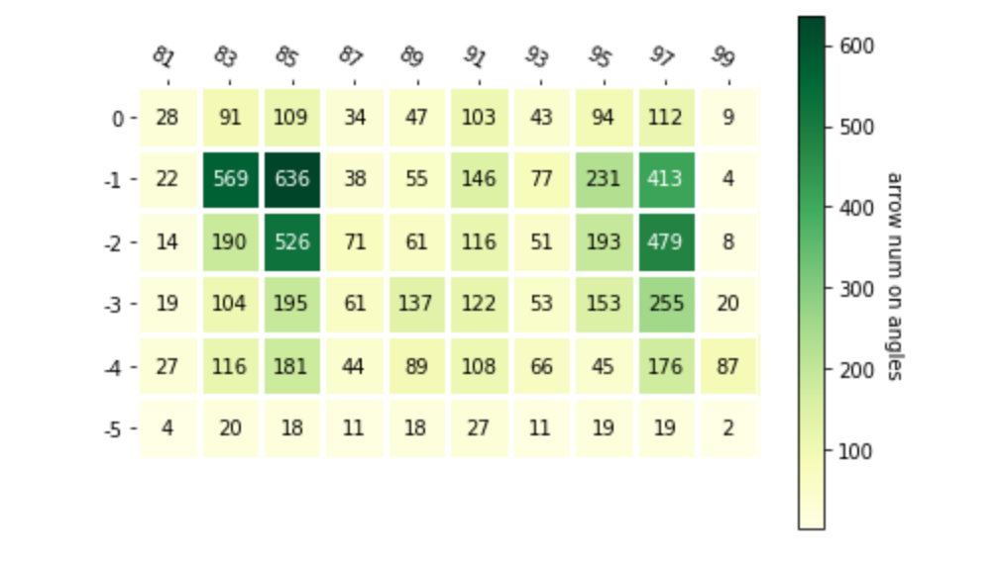

Also more arrow hit the target for the position learned more especially for (85,-1), but this map is not good enough to represent the accuracy of different angles. So we generate the last graph.

 

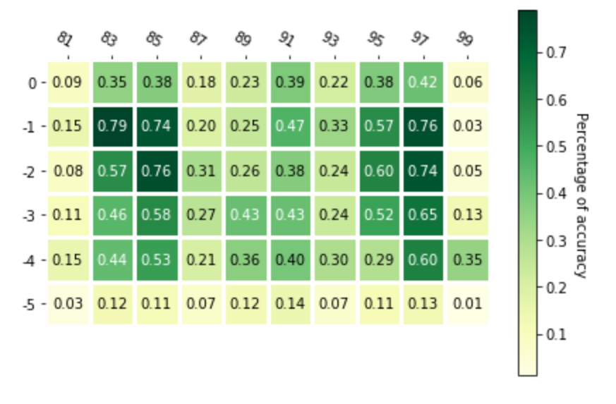

The map shows that more the area get trained then its accuracy is higher, usually concentrate on two sides of the closed area. For the angles that can only hit the wall or out of the closed area, the agent will choose as less as possible.

 

### Possible Error source:

Based on our group discussion, there are two possible factors that can affect the accuracy of our system

1. The arrows we shoot using the same y, pitch angle can drop at the different positions. As we can see from the graph below, the arrows destination varies a lot even if we use exactly the same angle to shoot

 

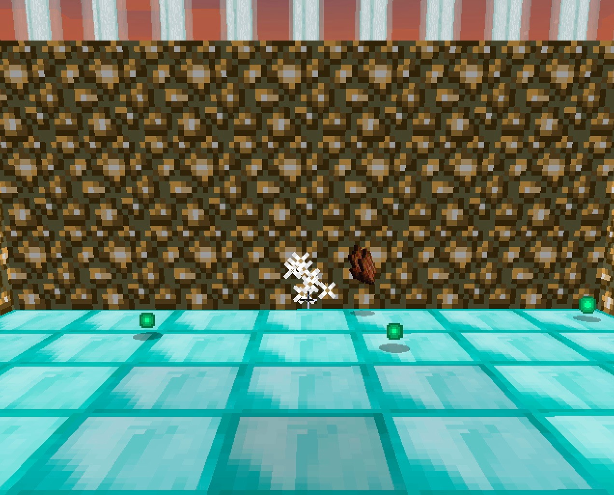
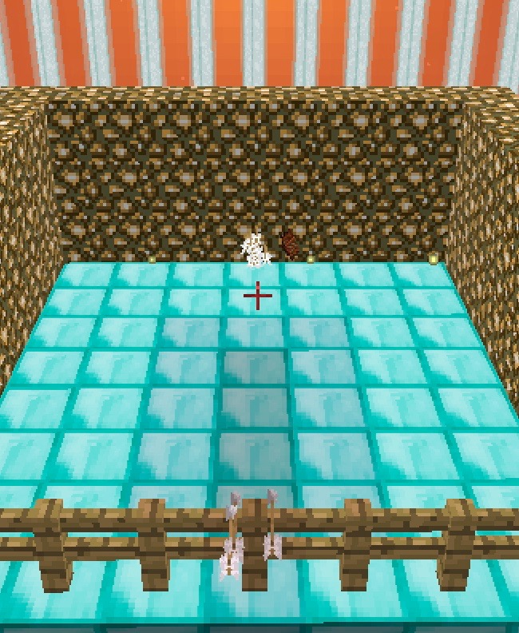

 
2. Even if the target is standing at the same position, target’s different facing direction can result in a different range of answer. We can tell from the different shooting area in the graphs here.

 

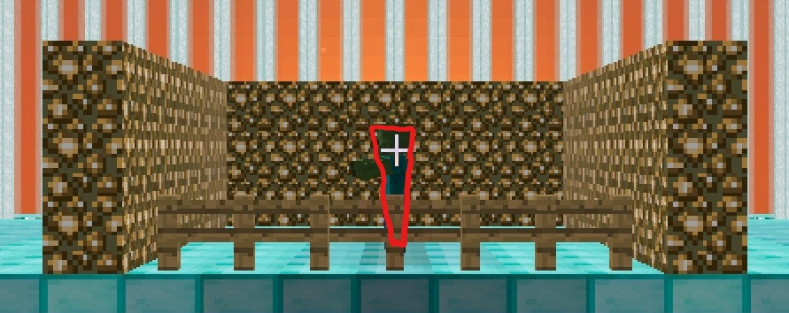
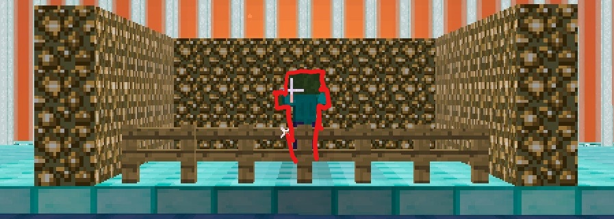
 

Overall the agent reaches our expectation of learning, since the task in some way is too complicated and unstable, so its accuracy also reach our expectation.

###  

## Reference

https://matplotlib.org/3.1.0/gallery/images_contours_and_fields/image_annotated_heatmap.html

http://users.isr.ist.utl.pt/~mtjspaan/readingGroup/ProofQlearning.pdf	

