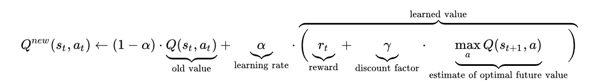

## Project summary

​		Our team topic is doing archery. More specifically, we want to teach our agent to kill the Mob using bow and arrows. Mob will be placed into a closed area  we created, and our agent will stand on a fixed block to learn its archery skill.  Each action made by agent is based on Mob’s current position and moving directions. When each round over, record will be updated so that system would always return the best result. Our final goal is to kill the Mob using the fewest arrows (3 shots). 

 

## Approach

### Algorithm

We Used one of most popular Learning Algorithm in Reinforcement learning for our case, ***Q-Learning***, which maintains a Q-table that will given a score for each state. Our agent  will choose the action based on the best score it can get from current state. After every action made by agent, the system will given a score based on  the formula above to update the Q-value for current state. 

- Q(s_t,a_t): is the old value of current state and current action
- a: is the learning rate that affect current Q-value
- r_t: is the current reward that system given based on current action
-   γ: is the constant value that times the best Q-value of next state as a part of reward.
- max ( Q(S_t+1,a) ): is the best Q-value of next state. 

At the beginning,  when Q - table is empty , there is no Q-score can be extracted for any states. Our group will use a factor called Epsilon as a random rate that give agent will perform a random action , then the system will give a reward (negative or positive) for the action that agent just made. Epsilon will decrease with the arrow numbers that our agent already performed. Indeed , (1- epsilon) is the possibility that the agent will choose the action based on the best Q-value of current state. For both cases, that new Q-value will be generated following the formula above.

 

### States & Actions

* State: (z, x, z_motion, x_motion)

  There are four variables in our state definition. Variables z and x represent the position of mob at z and x direction. Variables z_motion and value x_motion represent the moving forward or backward of the mob at z and x direction. We round the z, x value to be its nearest integer value because our target only takes one block area. There are 3 values for z_motion and x_motion which represents moving forwards(1), standstill(0) and moving backwards(-1). The states numbers of our project are 441, 225, 81 which represents our 3 different environment setting(easy, medium, hard).  

  

  - Easy: is that mode that Mob will trapped into a ***3x3*** closed area. (81 States)

  - Medium: is that mode that Mob will trapped into a ***5x5*** closed area.(225 States) ***Current mode we trained***

  - Hard:is that mode that Mob will trapped into a ***7x7*** closed area.(441 States)
  
   

* Action: (Yaw, Pitch, shoot/hold)

  Variables Yaw and Pitch represent the aiming angles in horizontal and vertical directions. Shoot/hold decides whether the agent shoot the arrow or not. For Yaw variable, we divide the continuous angle interval to the finite angle levels, which covers the horizontal activity range of the mob as shown in the graph below. Same thing applies to the Pitch variable. Since there are too many angles that agent can choose, so after several tests by hand we conclude different angles.
  
  
  

  - Easy: yaw5=[86,88,90,92,94]     pitch=[0,-1,-2,-3,-4,-5]     (total choices: 5x6x2=60)

  - Medium:  yaw5=[81,83,85,87,89,91,93,95,97,99] pitch=[0,-1,-2,-3,-4,-5] (total choices: 10x6x2=120) ***Current mode we trained***

  - Hard: yaw5=[77,79,81,83,85,87,89,91,93,95,97,99,101,103] pitch=[0,-1,-2,-3,-4,-5] (total choices: 14x6x2=168)

   
    

* Total combinations
  - Easy: states x actions= 81 x 60 =4860
  - Medium: states x actions= 225 x 120 = 27000
  - Hard: states x actions= 441 x 168 = 74088
  
   

### ways of states transfer

The ways of states transfer decides the value that will be used in the formula mentioned above to update Q-table.

 

1. ***States changed by Mob itself***
   When agent choose to shoot but not hit the target, or choose to hold. The states of the Mob will not be changed  by these two actions. Under this condition, Mob just move randomly in the closed area. Indeed, the next state is based on the current motion and its position. For example, if Current state is (3,5,1,-1) then the next state will be (4,4,0,0). Followed the Q-learning formula above new Q-value will be  ***(1-alpha) x Old Q-value + alpha(current reward + gamma x best Q-value for next state we generated)***. and also if we choose to shoot but we didn't hit the target, we will not only update the value current angle with shoot action, the system will also update Q-value for the current angle with hold action as  ***(1-alpha) x Old Q-value + alpha(3 + gamma x best Q-value for next state we generated)***. we replace current reward to positive three here. Indeed, next time when agent making decision about the same angle, hold action will have higher priority than shoot action. The reason we make the Q-table update twice rather than one is that the table will be state and action Q-value will be initialized as 0, and if we only make angle not hit the target to negative, then the table will choose the first action that has 0 reward and it will waste a lot of chance to learn. Indeed we will give a higher reward for this angle with hold action, then the agent will choose to hold until to get a new random angle to learn.
   
    
   

2. ***States changed by agent***
   In this case, the states will only change based on the precondition that agent hit the target. Every time, when mob hit by an arrow, he will retreat one or less than one block to the opposite direction of the arrow goes to. This state transfer way is really hard to measure its updated state immediately. Indeed, we set 5 arrows as one round.  if the target hit by agent then the reward will follow the current reward + rest 4 arrows' reward  times gamma(discount factor) with power (the difference of index of current arrow and other arrows)  because further arrows has less effect than current arrow. Indeed we will follow the formula above as form of ***(1-alpha) x Old Q-value + alpha(current reward + gamma x reward for next arrow we generated + gamma ^2 x reward for next  next arrow we generated+ ...)*** .

   
 

The way of states transfer decides the way of reward given to each state and action which will affect the new Q-value.

 

### Reward System

The reward given is based on the blood difference of Mob. 

If the action didn't hit the target reward will be -15.

if the action hit the target reward will be 17.

if the action kill the target reward will be 95

if the action is hold, reward will be 0.

 

### Keep learning

Q-table is stored in a Json file called q-table, which can be used for further learning. The folder Statistics also contains the Q-table on different training phases.

 

## Evaluation

## Remaining goals and challenges

### Final Goal

### Challenge

